<div align="center">

# 🤖 AI Agent Terminal Monitor

**Universal, autonomous watcher, TUI controller, and safe continuation supervisor for any AI coding agent CLI running in macOS Terminal.app, iTerm2, or tmux.**

[](https://www.python.org/downloads/)
[]()
[]()
[]()
[](https://opensource.org/licenses/MIT)

</div>

---

## 📌 Overview

When running autonomous AI coding agents (such as **Anthropic Claude Code**, **OpenCode**, **Aider**, **Block Goose**, **Devin**, or custom in-house agent CLIs), agents frequently pause waiting for continuation prompts, permission grants, mode transitions, or selection choices.

**AI Agent Terminal Monitor** is a generic, modular, and extensible supervisor that watches your terminal, intelligently classifies agent lifecycle states (`thinking`, `permission`, `question`, `completed`, `idle`), auto-resolves safe prompts, manages TUI modes (`Plan` vs `Build`), blocks unsafe/destructive operations, generates context-aware Git nudges, exports real-time status JSON, and keeps the agent progressing autonomously to goal completion.

> **State precedence:** explicit manual answers and safe permission prompts take priority. A question requires both a strong prompt and real selectable options, while an active child command counts as `thinking`. Completion is accepted only from output produced after the latest instruction, so an old “done” message cannot finish a newly assigned task.

<a href="docs/architecture-diagram.svg"></a>

<p><sub>Animated dark architecture · open the SVG for the full-resolution trace · respects reduced-motion preferences · visual direction inspired by the <a href="https://tt-a1i.github.io/archify/gallery.html#proof-web-app">Archify Proof Lab gallery</a>.</sub></p>

---

## ✨ Key Features

- 🧠 **Multi-Agent Profile Engine**: Built-in specialized detection heuristics for **Claude Code**, **OpenCode**, **Aider**, and **Goose**, with zero-config support for any custom CLI (`generic`).
- 🎛️ **TUI Mode Awareness & Auto-Transition**: Automatically detects agent interactive modes (e.g. `Plan` vs `Build` in OpenCode). When plan generation finishes, dispatches native switch keystrokes (`Tab`) and start approvals without human intervention.
- ⌨️ **Native Special Keys & Control Sequences**: Direct native dispatch for special characters (`Tab`, `Esc`, `Enter`, `Ctrl+C`, `Ctrl+P`) via native backend character codes without macOS Accessibility permission hurdles.
- 🌿 **Git-Aware Context Smart Nudges**: Inspects repository status dynamically to send targeted prompts:
  - *Uncommitted changes:* Prompts agent to run targeted tests and commit the task.
  - *Clean feature branch:* Prompts agent to run full verification, push branch and create PR.
  - *Open PRs:* Prompts agent to verify CI checks and merge into `main`.
- 🏁 **Completion Engine & Stop Conditions**: Detects when all plan tasks are 100% completed and merged, gracefully stopping the supervisor and firing completion events.
- 🧾 **Task Summary Reconciliation**: Prefers an affirmative agent summary such as `35/35 COMPLETE` over stale checklist markers left by an overlaid TUI Todo pane, while rejecting question-shaped text as completion evidence.
- 🧭 **Session Generations**: Separates terminal scrollback from the current interaction and rejects stale completion evidence after new work is assigned.
- ⚙️ **Real Process Activity**: Observes descendant commands, command age and CPU data, preventing a quiet terminal from being treated as stalled while tests or builds are still running.
- 🔂 **Agent Loop Guard**: Detects expensive commands relaunched repeatedly without task or Git progress, duplicate full test/build roots running concurrently, and monitored Git history rewrites. A changed task count, worktree, or commit resets the repetition counter; recoverable command loops are contained in-session while unsafe mutations pause for attention.
- 🧯 **In-session Loop Recovery**: For repeated test/build loops, interrupts only verified expensive child trees, waits for the complete tree to exit, escalates to `SIGTERM` when needed, keeps the root agent session alive, and sends a corrective prompt only after the child work has stopped. Unsafe history rewrites still fail closed for human attention.
- 🧾 **Idempotent Attempt Ledger**: Persists `queued → sent → accepted → completed` (or `ignored`) events with IDs, timestamps, prompts, and observed states so queued continuations survive restarts without being duplicated blindly; persisted monotonic timestamps fall back to UTC wall time after a reboot.
- 📨 **Visible Queue Protection**: Treats a terminal `QUEUED` marker as delivery still pending, suppresses duplicate nudges, and raises attention when the queue remains stuck beyond the configured timeout.
- 📜 **Durable Policy Envelope**: Stores the objective, prohibitions, task ID, required outcome, current stage, PR metadata, and session ID in `task-state.json`. Smart nudges are wrapped in permanent policy and cannot override an npm-publication prohibition.
- 🔁 **Native PR/CI Lifecycle**: Tracks `PR_CREATED → CI_PENDING → FIX_REQUIRED` or `CI_RETRY_REQUIRED → CI_GREEN → POST_MERGE_VERIFY`; checks are classified as `passed`, `failed`, `cancelled-infra`, or `failed-external` before retry decisions.
- 🔒 **Exact-Head Merge Gate**: `merge-pr` re-queries the full PR head SHA and every check immediately before calling `gh pr merge --match-head-commit`; changed heads, pending checks, cancellations, and failures fail closed.
- ✅ **Final-State Verifier**: Verifies merged PR, checks for the exact PR head, synchronized clean `main`, unchanged npm registry state, no new tag/release, and no active publish process.
- 🔍 **Refined Question vs Table Disambiguation**: Excludes Markdown/Unicode summary tables and code blocks from option parsing, eliminating false-positive dialog loops.
- 📊 **Real-time Status JSON Export**: Continuously exports live structured JSON (`status.json`) with PIDs, state, mode, git details, uptime, and send counts for IDE or dashboard integrations.
- 🖥️ **Automatic Web Command Center**: Every continuous monitor starts a localhost-only dark operations console, opens it in the browser, and streams color-coded lifecycle, safety, process, Git, task, and attempt events plus a bounded redacted terminal snapshot. HTTP status is a safe projection (prompts, payloads, child commands, and policy text are withheld), logs rotate at a bounded size, and the visual system uses a black glass shell, compact terminal typography, orange telemetry, and semantic status colors inspired by the referenced Evreghen Command Center.
- 🧭 **Branch and Worktree Safety**: Reports expected branch, protected-branch dirtiness, attempt history, CI evidence, policy decisions, and pauses supervised work when repository safety is violated.
- 🎯 **Stable Tab Targeting**: Prefers an exact custom Terminal.app tab title before the application suffix in a window name, avoiding cross-talk between neighboring OpenCode sessions.
- 📝 **Structured Final Reports**: Writes `final-report.json` with verification evidence, CI classifications, continuation attempts, policy decisions, the explicit npm prohibition, and the npm-publication invariant.
- 🖥️ **Universal Terminal Backends**:
  - `terminal`: Native macOS Terminal.app via AppleScript.
  - `iterm2`: Native macOS iTerm2 via AppleScript.
  - `tmux`: Native cross-platform tmux support (`capture-pane` & `send-keys`), enabling execution on **Linux, macOS, WSL, devcontainers, and remote SSH sessions**.
  - `auto`: Auto-detects active environment.
- 🛡️ **Fail-Closed Safety Engine**: Blocks dangerous actions (`rm -rf`, `delete`, `drop database`, `reset --hard`, `bypass`, etc.). Ambiguous or risky prompts halt the monitor with exit code `3` and export a snapshot to `attention.txt`.
- ⏱️ **Hard Timeouts & Resilience**: All subprocess calls (`osascript`, `git`, `gh`, `tmux`) run with hard timeouts, so a stuck terminal dialog or hung network call can never freeze the monitor. `Ctrl+C` exits cleanly (exit code `130`) and marks the status JSON as not running.
- 🔐 **Input Validation**: Process names and window-title filters are validated/sanitized before being embedded into AppleScript or shell commands.
- 📁 **Hierarchical Project Configuration**: Reads project settings from `.terminal-monitor.json` or `.terminal-monitor.toml` in your repository root, or globally from `~/.config/terminal-monitor/`. Unsafe phrases from CLI flags (`--unsafe-phrase`) are merged with the ones from the config file instead of replacing them.
- 🗂️ **Cached Git Context**: Repository status is cached with a 30-second TTL and short-lived status-export refreshes, keeping the polling loop cheap even with live status JSON export enabled.
- ✍️ **Live Human-in-the-Loop Override**: Write a message into `/tmp/terminal-monitor/answer.txt` — it is consumed, dispatched, and cleaned up automatically.
- 🐍 **Python SDK & OOP API**: Clean object-oriented library API (`TerminalMonitor`, `MonitorConfig`, `AgentProfile`) with lifecycle hooks (`on_state_change`, `on_mode_change`, `on_send`, `on_attention`, `on_complete`, `on_tick`).
- ⚡ **Zero External Dependencies**: Pure Python standard library. No pip installation required.

---

## 🚀 Quick Start (CLI)

### 1. Autonomous Supervision Mode (`supervise` / `-S`)
Run full autonomous supervision with automatic mode switching, safe permission approval, Git-aware smart nudges, real-time status export, and completion detection:

```bash
python3 terminal_monitor.py supervise \
  --profile opencode \
  --objective "Finish every task, create and merge the PR, then verify main." \
  --prohibition "Do not publish to npm."
```

### 2. Monitor Anthropic Claude Code
```bash
python3 terminal_monitor.py \
  --profile claude \
  --continue-text "Proceed with the remaining tasks and run the test suite."
```

### 3. Monitor OpenCode in a specific window/tab
```bash
python3 terminal_monitor.py \
  --profile opencode \
  --title my-project \
  --auto-allow-permissions
```

### 4. Monitor Aider in a tmux session
```bash
python3 terminal_monitor.py \
  --profile aider \
  --backend tmux \
  --continue-file instructions.txt
```

### 5. Inspect Without Sending (`--once` / `--dry-run`)
```bash
# One-shot inspection (JSON-safe, bounded, and credential-redacted)
python3 terminal_monitor.py --profile opencode --once

# Monitor in dry-run mode (logs decisions without typing to terminal)
python3 terminal_monitor.py --profile claude --dry-run
```

### 6. Colored status dashboard and lifecycle control
The status command reads the live heartbeat, agent state, current child
command, task progress, repository/CI stage, and safety policy. It detects a
stale PID instead of trusting an old `status.json` blindly:

```bash
python3 terminal_monitor.py status \
  --state-dir /tmp/terminal-monitor \
  --project-dir .

# Refresh continuously, or use --json for integrations
python3 terminal_monitor.py status --state-dir /tmp/terminal-monitor --watch
python3 terminal_monitor.py status --state-dir /tmp/terminal-monitor --json
```

Stop and resume affect only the monitor process; the agent remains untouched:

```bash
python3 terminal_monitor.py stop --state-dir /tmp/terminal-monitor
python3 terminal_monitor.py resume --state-dir /tmp/terminal-monitor --project-dir .
```

### 7. Operational control commands

```bash
# Explicit operator message; this also outranks a visible "thinking" spinner
python3 terminal_monitor.py send "Resume the remaining work" --profile opencode

# Interrupt PID 43210 and its descendants when it belongs to the agent
python3 terminal_monitor.py interrupt-child --pid 43210 --profile opencode

# Restart and continue the session saved in task-state.json
python3 terminal_monitor.py restart-agent --continue-session --profile opencode

# Verify repository, PR, CI, release and npm invariants
python3 terminal_monitor.py verify-final-state --project-dir . --state-dir /tmp/terminal-monitor

# Merge only the exact SHA whose checks were just verified
python3 terminal_monitor.py merge-pr --pr 42 --head <full-40-character-head-sha> \
  --project-dir . --state-dir /tmp/terminal-monitor

# Inspect the merge decision without querying GitHub or changing anything
python3 terminal_monitor.py merge-pr --pr 42 --head <full-40-character-head-sha> --dry-run
```

`interrupt-child` refuses the root agent PID and any PID outside its descendant tree. For a verified child it signals the complete subtree deepest-first, avoiding orphaned test runners and wrappers. `restart-agent` executes an argument vector directly without a shell. For a non-OpenCode CLI, use `--agent-command` when its continuation syntax differs.

### 8. Local web command center & Architecture Pipeline

Every continuous run (`supervise` or the regular monitor without `--once`) starts
the dark command center on `127.0.0.1` with a visual design inspired by the
[Archify Proof Lab](https://tt-a1i.github.io/archify/gallery.html#proof-web-app).
The chosen `web_port` is used when it is available; a busy port falls back to an
ephemeral localhost port and the URL is recorded in `status.json`. Use `--no-web-ui`
to disable the server or `--no-web-open` to keep the server running without opening a browser.

The HTTP surface supports real-time Server-Sent Events (SSE) streaming and manual operator interaction:

| Endpoint | Method | Contents |
|---|---|---|
| `/` | `GET` | Dark Archify-style console with stage pipeline, task plan, live metrics, quick actions, and terminal panes |
| `/api/stream` | `GET` | Real-time Server-Sent Events (SSE) stream for instant, low-latency UI updates |
| `/api/send` | `POST` | Dispatches operator answers, continuation prompts, smart nudges, or mode switch keystrokes (`Tab`) |
| `/api/status` | `GET` | Safe projection of state, Git, task progress, CI stage and attempt status |
| `/api/events` | `GET` | Last 400 event lines with credentials and free-form payloads redacted |
| `/api/terminal` | `GET` | Last bounded terminal snapshot after credential masking |

#### 🎛️ Operator Quick Actions & Task Plan View
- **Architecture Stage Pipeline:** Visual indicator tracking progress across `TASK_RECEIVED → EXECUTING → VERIFYING → PR_CREATED → CI_CHECKS → MERGED`.
- **Interactive Task Showcase:** Displays all detected tasks with state badges (`DONE`, `ACTIVE`, `TODO`), search filter, and category pills (`ALL`, `ACTIVE`, `PENDING`, `DONE`).
- **Quick Action Bar:** One-click operator actions (`Approve (yes)`, `Continue`, `Mode (Tab)`, `Nudge`) and custom instruction prompt dispatch directly from the browser.

Prompts, attempt payloads, child commands, configured prohibitions and policy
actions are not returned by the HTTP projection. The files remain local and are
written with restrictive permissions; `monitor.log` rotates to `monitor.log.1`
when it reaches the 2 MiB bound. The terminal snapshot is written to
`terminal-snapshot.txt` and is limited to the same 6,000-character inspection
bound.

#### 🗂️ Project-Level State Isolation & Working Directory Discovery
- **State Isolation:** Automatically scopes monitor state and logs per project directory in `/tmp/terminal-monitor/<project-name>-<hash>/`, preventing cross-project state pollution.
- **Process Working Directory Discovery:** When `--project-dir` is unspecified, automatically detects the agent process `cwd` via `lsof` / `/proc`.
- **Smart Protected Branch Nudge:** When direct changes occur on `main` before a feature branch is created, automatically prompts the agent to branch before halting.
- **Task Title Reconciliation:** Reconciles truncated TUI checklist labels (e.g. `[ ] Task 1: Freeze security-`) with full plan descriptions found in the terminal history.

---

## 📦 Project Configuration

Generate a configuration template in your repository root:

```bash
# JSON Format
python3 terminal_monitor.py init --format json -o .terminal-monitor.json

# TOML Format
python3 terminal_monitor.py init --format toml -o .terminal-monitor.toml
```

### Example `.terminal-monitor.json`
```json
{
  "profile": "opencode",
  "process": "opencode",
  "title": "my-project",
  "backend": "auto",
  "continue_text": "Continue with the next task according to the plan.",
  "poll_seconds": 3.0,
  "idle_seconds": 15.0,
  "cooldown_seconds": 20.0,
  "gone_seconds": 25.0,
  "max_sends": 100,
  "auto_allow_permissions": true,
  "supervise": true,
  "smart_nudges": true,
  "auto_switch_modes": true,
  "completion_check": true,
  "state_dir": "/tmp/terminal-monitor",
  "objective": "Finish every task, create and merge the PR, then verify main.",
  "prohibitions": ["Do not publish to npm."],
  "task_id": "work-42",
  "required_outcome": "merged",
  "npm_publish_allowed": false,
  "session_id": "ses_123",
  "expected_branch": "codex/work-42",
  "protected_branches": ["main", "master"],
  "report_path": "/tmp/terminal-monitor/final-report.json",
  "attempt_history_limit": 100,
  "loop_guard": true,
  "loop_repeat_limit": 3,
  "queued_attempt_seconds": 45.0,
  "allow_history_rewrite": false,
  "loop_interrupt_wait_seconds": 2.0,
  "web_ui": true,
  "web_port": 8765,
  "web_open_browser": true,
  "unsafe_phrases": [
    "bypass",
    "delete",
    "discard",
    "drop database",
    "force",
    "format disk",
    "hard reset",
    "no-verify",
    "overwrite",
    "purge",
    "remove protection",
    "reset --hard",
    "rm -rf",
    "skip validation",
    "weaken"
  ],
  "custom_profiles": {
    "my-agent": {
      "process": "myagent",
      "description": "Custom agent CLI configuration",
      "thinking_patterns": ["agent is thinking...", "processing..."],
      "permission_patterns": ["do you authorize this action?"],
      "auto_permission_payload": "y",
      "mode_patterns": { "plan": "Plan Mode", "build": "Build Mode" },
      "completion_patterns": ["all tasks complete"]
    }
  }
}
```

---

## 🐍 Python SDK API

You can embed `TerminalMonitor` directly into your Python tools, test suites, or custom agent frameworks:

```python
from terminal_monitor import (
    TerminalMonitor,
    MonitorConfig,
    get_profile,
    get_backend,
)

# 1. Configure monitor
config = MonitorConfig(
    process="opencode",
    profile="opencode",
    supervise=True,
    smart_nudges=True,
    auto_switch_modes=True,
    completion_check=True,
    objective="Finish every task, merge the PR, and verify main.",
    prohibitions=["Do not publish to npm."],
    task_id="work-42",
    session_id="ses_123",
)

# 2. Instantiate monitor
monitor = TerminalMonitor(config)

# 3. Register lifecycle hooks
monitor.on_state_change = lambda old_state, new_state: print(f"State: {old_state} -> {new_state}")
monitor.on_mode_change = lambda old_mode, new_mode: print(f"TUI Mode: {old_mode} -> {new_mode}")
monitor.on_send = lambda reason, payload, ok: print(f"Sent [{reason}]: {payload}")
monitor.on_complete = lambda snapshot: print("Task execution finished successfully!")
monitor.on_attention = lambda reason, snapshot: print(f"⚠️ Human attention needed ({reason})")

# 4. Run loop (or call monitor.step() for single iteration)
exit_code = monitor.run()
```

---

## 📊 Live Status JSON Structure

Whenever a state directory exists, `TerminalMonitor` atomically maintains `<state-dir>/status.json`; `--status-json` can redirect it. It also maintains `<state-dir>/task-state.json` with durable task and PR state.

```json
{
  "schema_version": 2,
  "running": true,
  "lifecycle": "running",
  "monitor_pid": 21340,
  "monitor_instance_id": "4f2c...",
  "started_at": "2026-08-24T18:00:00Z",
  "heartbeat": "2026-08-24T18:00:12Z",
  "pids": [21353],
  "process": "opencode",
  "profile": "opencode",
  "state": "thinking",
  "mode": "build",
  "sends": 14,
  "stable_seconds": 12.4,
  "activity": {
    "active": true,
    "descendants": [21401],
    "commands": ["python3 -m unittest discover -s tests"],
    "cpu_percent": 74.2,
    "oldest_seconds": 18.0
  },
  "task": {
    "task_id": "work-42",
    "detected_id": "work-42",
    "stage": "CI_PENDING",
    "session_generation": 3,
    "pr": {"number": 42, "head": "d78ae3d..."},
    "npm_publish_allowed": false
  },
  "todo": {
    "total": 6,
    "completed": 3,
    "in_progress": 1,
    "pending": 2,
    "items": [{"label": "Run tests", "state": "in_progress"}],
    "source": "tui_markers",
    "evidence": ""
  },
  "last_action": "observe:thinking",
  "last_command": "python3 -m unittest discover -s tests",
  "history": {"available": true, "redacted": true, "max_chars": 6000},
  "attempts": [
    {
      "attempt_id": "attempt-1724440000000-1",
      "status": "accepted",
      "reason": "smart_nudge",
      "timestamp": "2026-08-24T18:00:00Z"
    }
  ],
  "ci_events": [],
  "policy_decisions": [],
  "prohibitions": ["Do not publish to npm."],
  "npm_publish_allowed": false,
  "repository_safety": {
    "safe": true,
    "reason": "ok",
    "branch": "feat/rc6-closing-fixes",
    "dirty": false
  },
  "report_path": "/tmp/terminal-monitor/final-report.json",
  "git": {
    "branch": "feat/rc6-closing-fixes",
    "head": "d78ae3d...",
    "dirty": false,
    "modified": 0,
    "untracked": 0,
    "modified_files": [],
    "open_prs": 1,
    "last_commit": "d78ae3d fix(types): commit ambient declarations"
  },
  "timestamp": "2026-08-23T19:45:00Z"
}
```

The `todo.source` field is `tui_markers` for checklist parsing or
`explicit_summary` when an affirmative agent report supersedes stale overlaid
markers; `todo.evidence` contains the bounded, redacted summary line used for
that decision.

`status` renders this data as a colored dashboard. `--json` returns the
combined live and durable state for integrations. Terminal history exposed by
`--once` and `attention.txt` is bounded and credential-redacted by default.
When a supervisor is killed without a final heartbeat, `status` reports
`STALE` instead of claiming that it is still running.

## PR/CI and final-verification stages

The supervisor persists these stages instead of inferring progress only from terminal prose:

| Stage | Meaning | Automatic action |
|---|---|---|
| `TASK_RECEIVED` | Work is active | Continue from the task plan |
| `PR_CREATED` / `CI_PENDING` | PR exists and checks are incomplete | Wait for a state change |
| `FIX_REQUIRED` | A code check failed | Return the agent to diagnosis and tests |
| `CI_RETRY_REQUIRED` | Cancel, timeout, network or infrastructure failure | Retry only the affected workflow run |
| `CI_GREEN` | Exact PR head is green | Proceed to merge |
| `POST_MERGE_VERIFY` | PR is merged | Run `verify-final-state` invariants |

Each check also carries a durable classification: `passed`, `failed`,
`cancelled-infra`, or `failed-external`. A `429`, rate limit, timeout, or
network response is retryable evidence, while a test assertion remains a code
failure requiring a fix.

`answer.txt`, `stop`, process-tree changes, git changes, and CI stage changes can wake supervision early; a bounded timer remains as a portable fallback.

## Migration notes

- Existing configurations remain valid.
- `status.json` is now created by default inside `state_dir`; remove consumers that assumed it existed only with `--status-json`.
- `npm_publish_allowed` defaults to `false`. Enabling publication requires the explicit `--allow-npm-publish` flag or configuration value.
- `expected_branch` is optional. Supervision captures the current branch as its
  baseline when it is omitted, and pauses with `ATTENTION_REQUIRED` if the
  branch changes; dirty `main`/`master` is always treated as unsafe.
- `final-report.json` is written beside `status.json` by default and contains
  the final checks, evidence, attempts, CI classifications, policy decisions,
  and the explicit npm prohibition.
- `monitor.json` and `monitor.pid` identify the live supervisor. `stop`
  sends a signal only after verifying that PID belongs to this monitor;
  `resume` uses the saved, validated launch vector and never targets the
  agent process.
- `SIGINT` and `SIGTERM` now write a final heartbeat with
  `lifecycle: "stopped"`; consumers should use `monitor_alive`/stale
  detection instead of trusting an old `running` value.
- `web_ui`, `web_port`, `web_open_browser` and `loop_interrupt_wait_seconds`
  control the command center and loop containment. The generated JSON/TOML
  templates include these fields; `web_port` accepts only `0..65535`, where `0`
  requests an ephemeral port.
- `terminal-snapshot.txt` is the redacted dashboard feed and `monitor.log.1`
  is the single rotated event-log archive. Consumers should use `/api/status`
  rather than exposing `status.json` directly when serving a UI.
- `--dry-run` never sends terminal text or keys, starts an agent, or merges a
  PR. `merge-pr --dry-run` only prints the planned exact-head action.
- A malformed `task-state.json` stops initialization with `StateFileError` instead of silently discarding safety policy.

---

## 🧪 Running Tests & Lint

Run the complete built-in unit test suite (zero external test dependencies):

```bash
python3 -m unittest discover -s tests -v
```

Lint checks (used by CI) run via [ruff](https://docs.astral.sh/ruff/):

```bash
pip install ruff
ruff check terminal_monitor.py supervisor.py tests/
```

---

## 📄 License

MIT License. See [LICENSE](LICENSE) for details.
